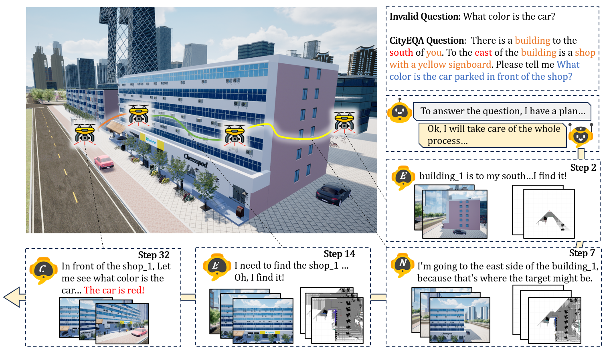
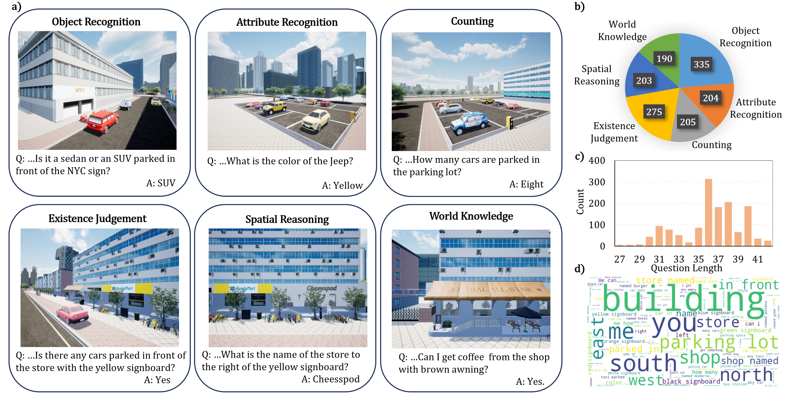
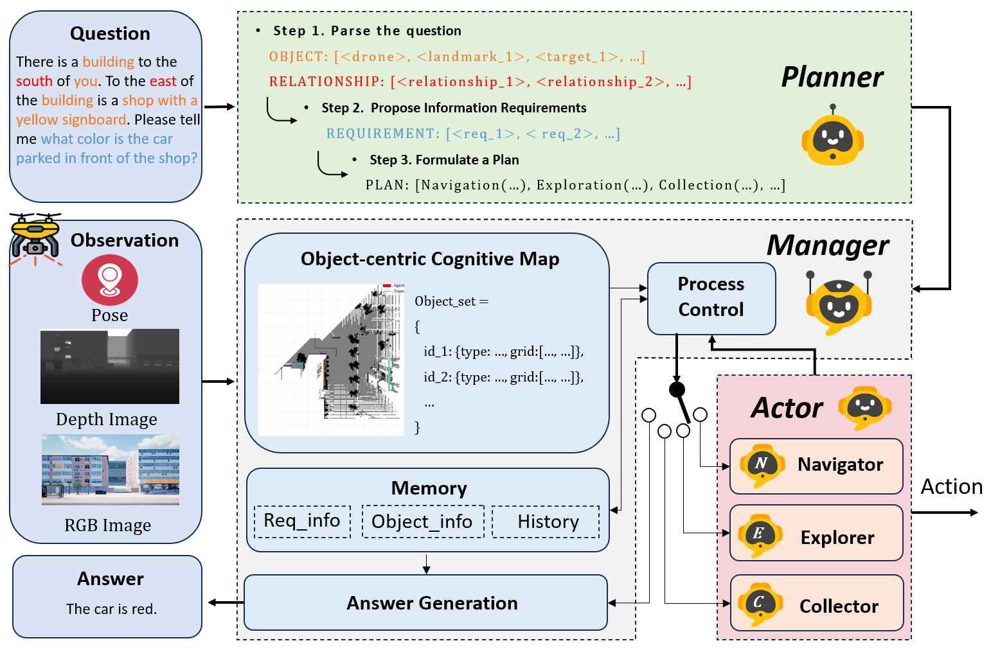
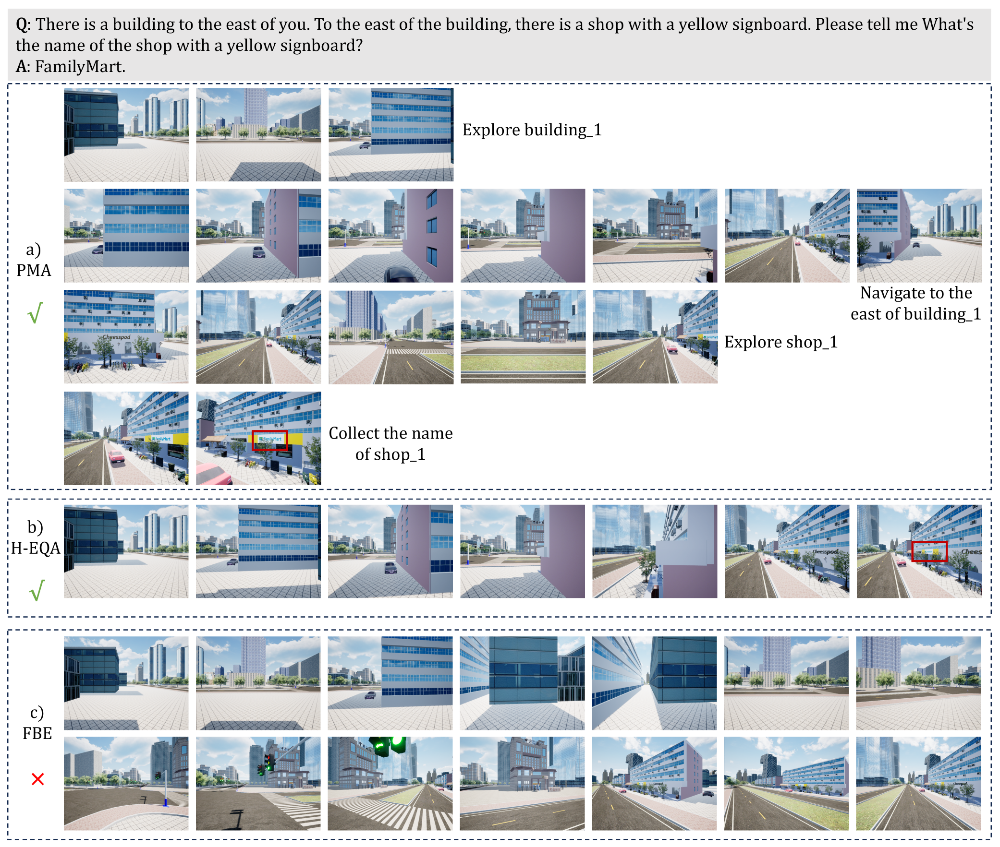

# CityEQA: A Hierarchical LLM Agent on Embodied Question Answering Benchmark in City Space


## News

**We are currently organizing the code for CityEQA. If you are interested in our work, please star ⭐ our project.**

- **(2025/02/17)** Code and CityEQA-EC dataset are released!
- **(2025/04/01)** The dataset and visual case are updated.


### An example of our CityEQA task and the typical workflow of the proposed PMA agent''
<p align="center">
  
</p>


### CityEQA-EC dataset

The CityEQA-EC dataset comprises 1,412 task data entries across six distinct categories. a) examples of each type of task; (b) the number of tasks in each of the six categories; (c) the length of the questions within the tasks, which tend to be longer than those in indoor EQA datasets due to the inclusion of landmark and spatial relationship indicators; and (d) a word cloud distribution of the questions, highlighting the Language diversity within the dataset.

<p align="center">
  
</p>

### Overview of the PMA agent
<p align="center">
  
</p>

### Typical case of the PMA agent and baselines

As illustrated in the figure, PMA can decompose long-horizon CityEQA tasks into multiple sequential sub-tasks for execution. It also enhances the quality of visual input through fine-tuning during the Collection phase. H-EQA, which is controlled by humans, is typically highly efficient in locating target objects based on the question. Moreover, humans' robust visual understanding and reasoning capabilities enable them to obtain information about the target objects from a considerable distance. In contrast, Frontier-based Exploration (FBE) performs poorly in open and large-scale city spaces, struggling to find target information and answer questions.
<p align="center">
  
</p>


### Directory Structure:

```
.
├── README.md
├── main_NE  # The Navigation and Exploration process
├── main_C  # The Collection process
├── Agent
│   ├── All agent modules of CityEQA.
├── Data
│   ├── The CityEQA-EC Dataset.
├── Evaluation
│   ├── LLM-score code and prompt.
├── GroundSAM
│   ├── GroundSAM model files.
├── Utils
│   ├── utils and arguments files.


```


